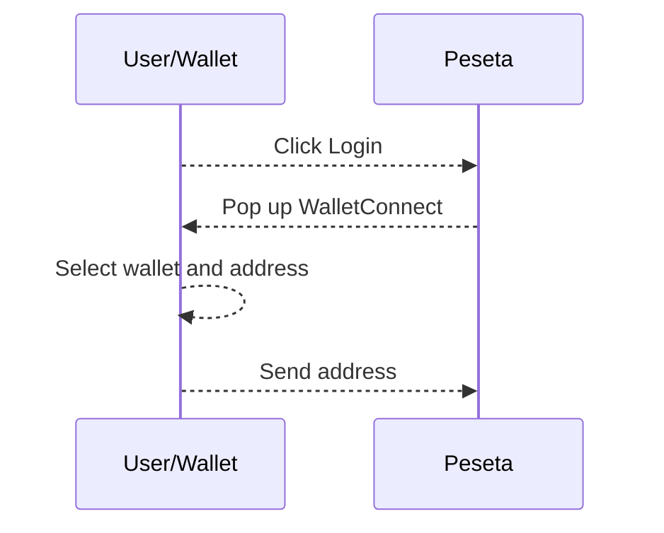
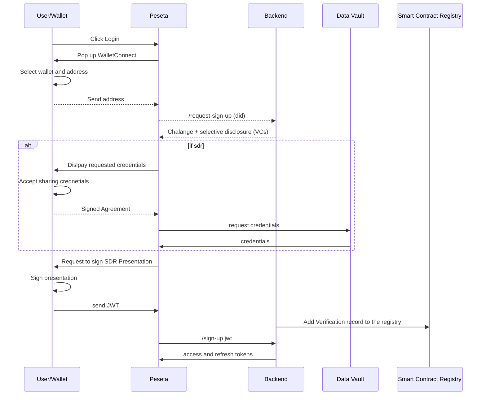

1. Use metamask - No need to create user wallet
2. Create DID Declarative details (like) in rif-identity-manager
3. Login to Peseta with rLogin
4. Request VCs from issuer with bank credentials
	1.  should use bank API to populate user [data](https://github.com/growr-xyz/growr-on-chain-backend/blob/dev/model/user.js) and create VC
5.  Request credentials verification to disburst loan. 

## Pesta Login with metamask

In react app: https://bit.ly/rlogin-sample-app-login
also here: https://github.com/rsksmart/rLogin-essentials

## Peseta Login with selective disclosure from App

Looks like we have option to request VCs out of the box with rLogin only with backend. For pond discovery we either move it after login and selective disclosure of the desired credentials or we have to find a way to select credentials we would like to present before the getOffer request from Peseta to SC.

